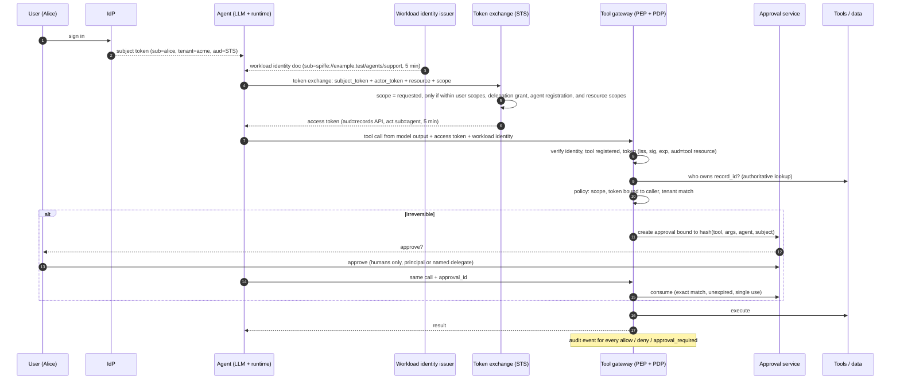

# agent-authorization-reference

[](https://github.com/achandra-security/agent-authorization-reference/actions/workflows/ci.yml)

**Zero Trust identity and authorization for AI agents, enforced at the tool-invocation boundary.**

A language model decides *what it wants to do*. It must never be the thing that decides *whether it is allowed to*. This repository is a working reference architecture for that separation. Every tool call passes through a deterministic, deny-by-default policy enforcement point. That point checks a verified workload identity, a short-lived delegated access token, tenant ownership taken from the data store, and, for irreversible actions, a human approval bound to the exact request. Every decision is audited.

It is standard-library Python, it has no dependencies, and it uses synthetic data.

## Five-minute tour

```bash
git clone https://github.com/achandra-security/agent-authorization-reference && cd agent-authorization-reference
python -m pip install -e ".[dev]"
agentauthz-demo            # or: python -m agentauthz.demo
```

Abridged output. The full run is in [`examples/demo_output.txt`](examples/demo_output.txt).

```text
[2] After reading injected content, model asks to delete ANOTHER tenant's record and claims approval
    -> DENIED: scope 'records:delete' not granted (token has ['records:read']);
               resource belongs to tenant 'globex', token is for 'acme'
[3] Same request with a delete-scoped token: tenant isolation still denies it
    -> DENIED: resource belongs to tenant 'globex', token is for 'acme'
[4] Agent asks the STS for an admin scope Alice never delegated
    -> STS REFUSED (invalid_scope): not in 'user holds': ['records:admin']; not in 'user delegated to agent': ...
[5] Model asks to delete Alice's own record acme-002 (irreversible), again claiming approval
    -> PENDING_APPROVAL: irreversible action requires human approval
[11] Injected instruction swaps the recipient and reuses Alice's approval
    -> DENIED: approval was granted for a different request
[13] Agent replays the same approval a second time
    -> DENIED: approval already used (single use)
[14] A different agent presents the support agent's access token (stolen token)
    -> DENIED: token was issued to actor 'spiffe://example.test/agents/support', but the caller is '.../reporting'
```

## Architecture



A component view and threat-by-threat mapping are in [`docs/architecture.md`](docs/architecture.md).

## What is implemented

| Control | How it works here | Where |
|---|---|---|
| Agent identity | Workload identity documents whose subject is a validated SPIFFE ID, verified by the gateway on every call | `identity.py` |
| Delegated scopes | RFC 8693-style token exchange. Issued scope = requested ∩ user scopes ∩ user's delegation grant to this agent ∩ agent registration ∩ resource scopes. It never widens | `sts.py` |
| Resource-specific tokens | RFC 8707 `resource` is required. The token `aud` is that resource, and the gateway checks `aud` equals the tool's resource | `sts.py`, `gateway.py` |
| Actor binding | The token's `act.sub` must equal the verified caller identity, so a stolen token is useless to other workloads | `policy.py` |
| Tenant isolation | Ownership comes from the store and is compared with the token's `tenant`. Tenant names in model arguments are ignored | `policy.py`, `store.py` |
| Short-lived credentials | Identity documents and access tokens last 5 minutes, and access tokens never outlive the subject token | `identity.py`, `sts.py` |
| Deny by default | Unknown tools, malformed calls, missing tokens, and any failed check are denied | `gateway.py`, `policy.py` |
| Human approval | Irreversible tools need an approval bound to a hash of the exact request. It is humans only, principal or named delegate, never the agent, single use, and it expires | `approvals.py` |
| Audit | A structured event for every allow, deny, and approval_required, with reasons, caller, subject, tenant, and token `jti` | `audit.py` |

## Illustrative versus cryptographically verified

This distinction matters, so it is spelled out.

- **Cryptographically verified in this code:** every token is a real HS256 JWS, and signature, algorithm, issuer, audience, expiry, and not-before are checked. That covers user tokens, workload identity documents, and exchanged access tokens. `alg: none`, tampered claims, wrong keys, and unknown key IDs are rejected (see `tests/test_tokens_identity.py`). Keys are generated randomly at startup and never stored in the repository.
- **Illustrative, not production infrastructure:**
  - The workload identity documents are a *stand-in* for SPIFFE JWT-SVIDs. There is no SPIRE server, no node or workload attestation, no trust bundle, and no X.509-SVID or mTLS. The SPIFFE ID *format* is validated, but the *issuance* is simulated.
  - The STS implements RFC 8693 *request and response semantics* in process. It is not an HTTP OAuth endpoint, has no client authentication, and uses symmetric keys. A production STS would use asymmetric signing keys published through JWKS.
  - The IdP, delegation registry, approval service, and data store are in-memory.

Nothing here should be described or deployed as production SPIFFE or OAuth infrastructure. It is a reference for *where* each control belongs and *what* it must check.

## Tests

```bash
python -m pytest -v
```

The suite covers token forgery and validation (tampering, `alg: none`, expiry, issuer and audience), SPIFFE ID parsing, every STS ceiling and error code, actor-chain preservation, every gateway deny path, approval binding, single use, expiry, and denial, audit completeness, and a full end-to-end demo run. CI runs it on Python 3.10, 3.11, and 3.12.

## Security assumptions and limitations

- The gateway is the only path to tools. If an agent can reach the data store or APIs directly, none of this applies. Network policy has to enforce that.
- Tool classification (`read`, `write`, `irreversible`) and required scopes come from a trusted registry that operators maintain. Misclassifying a destructive tool as `write` removes the approval gate.
- Approval UX is out of scope. The service assumes the human sees an accurate rendering of the fingerprinted request. A misleading summary would defeat informed consent.
- Token revocation is by expiry only. There is no introspection or revocation list.
- Single-process, in-memory state, so there is no replay protection across restarts or replicas. A real deployment needs a shared store for approvals and used `jti`s.

## Roadmap (not implemented)

- Integration with a real SPIRE deployment (JWT-SVID via the Workload API) and an OAuth authorization server that supports token exchange
- Asymmetric token signing (ES256) with JWKS rotation
- Policy expressed in OPA/Rego or Cedar, evaluated by the same gateway
- An MCP server wrapper so the gateway can sit in front of MCP tools
- Emitting audit events in the agentwatch event format for downstream detection ([agentwatch](https://github.com/achandra-security/agentwatch))

## License

MIT. This is original code written as a public reference implementation. It contains no employer code, configurations, or data.
