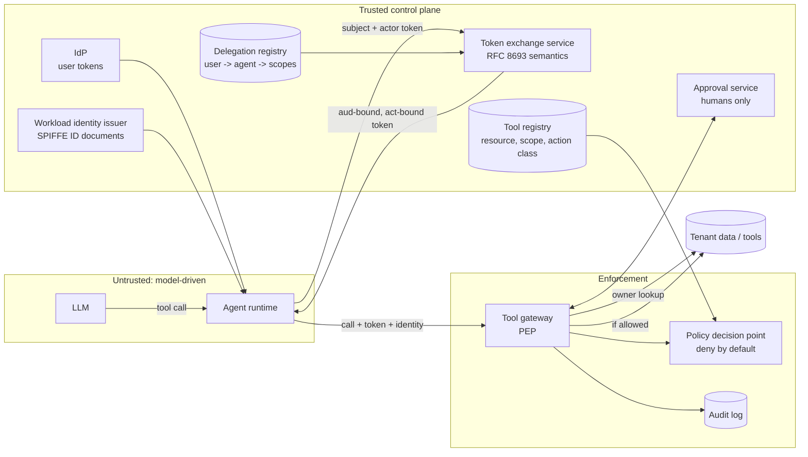

# Architecture

## Principle

> The model proposes; deterministic policy disposes.

Agent frameworks often implement permission checks inside the prompt ("only delete records the user owns"). A prompt is not an access control. Indirect prompt injection, a confused reasoning chain, or a malicious tool description can all produce a well-formed tool call that the model sincerely "wants" to make. This reference moves every authorization input out of the model's reach:

| Decision input | Source | Can the model influence it? |
|---|---|---|
| Who is calling | Workload identity document verified by the gateway | No |
| Who the agent acts for | `sub` of an STS-issued token | No |
| What the agent may do | `scope` of that token, the intersection of four ceilings | No |
| Which API the token is valid for | `aud` of that token (RFC 8707 resource) | No |
| Which tenant owns the target | Authoritative lookup in the data store | No |
| Whether an irreversible action is approved | Approval service, bound to a hash of the exact request | No |
| Which tool and which resource ID | The model's tool call | **Yes, and that is all it controls** |

## Components



## Threats and the control that stops each

| Threat | Example | Control | Test |
|---|---|---|---|
| Indirect prompt injection drives a harmful call | Email says "delete globex-001, admin approved" | Scope and tenant checks ignore model-supplied claims | `test_model_supplied_authorization_claims_are_ignored` |
| Cross-tenant access | Model names another tenant's record | Owner from store must equal token tenant | `test_cross_tenant_access_denied_even_when_model_names_the_tenant` |
| Privilege escalation through delegation | Agent requests `records:admin` | STS intersection of four ceilings; `invalid_scope` | `test_scope_can_never_widen` |
| Token theft or replay by another workload | Reporting agent uses the support agent's token | `act.sub` must equal the verified caller | `test_stolen_token_presented_by_another_agent` |
| Token reuse against another API | Records token presented to billing | `aud` must equal the tool resource | `test_token_for_another_resource_is_rejected` |
| Long-lived credential abuse | Token reused hours later | 5-minute TTL, capped by subject token | `test_expired_access_token`, `test_issued_token_never_outlives_subject_token` |
| Approval laundering | Approval for recipient A reused for recipient B | Approval bound to a request fingerprint | `test_irreversible_action_requires_bound_single_use_human_approval` |
| Self-approval or wrong approver | Agent, or another tenant's user, approves | Humans only; principal or named delegate | same test |
| Approval replay | Same approval used twice | Single use, with expiry | `test_approval_is_single_use_and_expires` |
| Invented or unregistered tools | `run_shell` | Registry lookup; deny by default | `test_deny_by_default_for_unknown_or_malformed_calls` |
| Forged tokens | `alg: none`, edited claims | Signature and algorithm pinning | `test_alg_none_rejected`, `test_tampered_claims_rejected` |

## Token shapes

Access token issued by the STS (decoded):

```json
{
  "iss": "https://sts.example.test",
  "sub": "user:alice",
  "aud": "https://records.example.test",
  "tenant": "acme",
  "scope": "records:read",
  "act": {"sub": "spiffe://example.test/agents/support"},
  "iat": 1788000000,
  "exp": 1788000300,
  "jti": "..."
}
```

`act` follows RFC 8693 section 4.1: the outermost `act` is the current actor, and prior actors are nested inside it. That way a chain such as orchestrator to sub-agent stays auditable.

## Mapping to production components

| Reference component | Production counterpart |
|---|---|
| `WorkloadIdentityIssuer` | SPIRE server and agent issuing JWT-SVIDs or X.509-SVIDs after attestation |
| `SecurityTokenService` | An OAuth authorization server that supports RFC 8693 token exchange and RFC 8707 resource indicators |
| `PolicyDecisionPoint` | OPA/Rego, Cedar, or an equivalent PDP, fed by a tool registry |
| `ToolGateway` | An API gateway or sidecar in front of tools and MCP servers, the only network path to them |
| `ApprovalService` | Step-up confirmation in a trusted UI, with a shared store for single-use state |
| `AuditLog` | SIEM pipeline (see agentwatch for detections over these events) |
